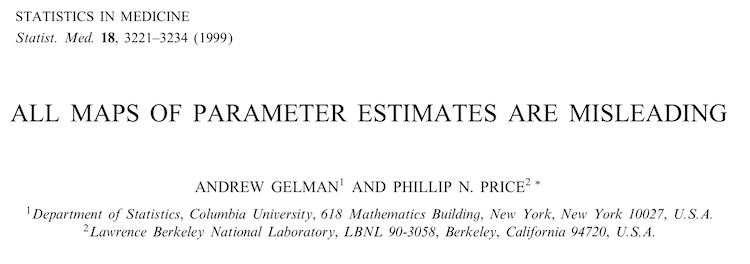
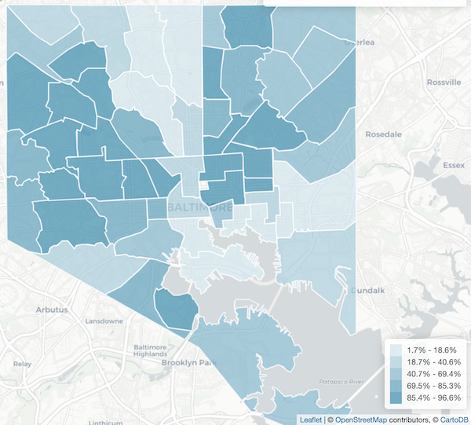

```{r setup, include=FALSE}
knitr::opts_chunk$set(tidy.opts=list(width.cutoff=50),tidy=TRUE)
```

## Open code

This presentation uses R, a free, open-source statistical programming language.

These slides are autogenerated during the data analytic process using ```ioslides```, allowing for complete reproducibility.

All the code is embedded in this file but it won't be displayed in every slide. For the full code you can go to <https://github.com/peterphalen/ceasefire/tree/master/mirecc-presentation>, but check out <https://peterphalen.github.io/ceasefire> for a reader-friendly walkthrough.

## Open data

Baltimore releases detailed data on issues relevant to the city at <https://data.baltimorecity.gov>. 

Crime data is released with a lag of just a week or so. 

This allows us to get a decent idea of the distribution of shootings in Baltimore.

## Get the Data

```{r, include=F}
library(tidyverse)
library(scales)
```

The data on shootings comes from <https://data.baltimorecity.gov/Public-Safety/BPD-Part-1-Victim-Based-Crime-Data/wsfq-mvij/data>

```{r, eval = FALSE}
url <- "https://raw.githubusercontent.com/peterphalen/ceasefire/
        master/BPD_Part_1_Victim_Based_Crime_Data.csv"
bpd <- readr::read_csv(url)
names(bpd)
```

```{r, echo = FALSE, message=F, warning=FALSE}
url <- "/Users/peterphalen/Documents/ceasefire/BPD_Part_1_Victim_Based_Crime_Data.csv"
bpd <- readr::read_csv(url)
```
```{r, echo = FALSE, message=F}
names(bpd)
```


## Process data

The dataset documents many types of crimes. We subset to shootings, i.e., non-lethal shootings and homicides with a firearm.
```{r, message = FALSE}
bpd <- subset(bpd, Description == "SHOOTING" |
       (Description == "HOMICIDE" & Weapon == "FIREARM"))
```

There are usually many shootings per day, so we collapse the data down to daily counts.
```{r, message = FALSE}
bpd$CrimeDate <- as.Date(bpd$CrimeDate, format = "%m/%d/%Y")
daily <- bpd %>% group_by(CrimeDate) %>% summarise(shootings = n())
# fill missing dates, because many had no shootings
full.ts <- data.frame(CrimeDate = 
                        seq(daily$CrimeDate[1],
daily$CrimeDate[nrow(daily)], by="day"))
daily <- full_join(full.ts,daily)
daily <- daily %>% group_by(CrimeDate) %>%                         mutate_all(funs(ifelse(is.na(.),0,.)))
```

# Where are these shootings happening?

## Disclaimer about maps





```{r, include=FALSE}
#prepare map data
library(geojsonio)
library(leaflet)

bpd$Neighborhood <- as.character(bpd$Neighborhood)
bpd <- subset(bpd, !is.na(Neighborhood))

count <- bpd %>%
  group_by(Neighborhood) %>%
  summarise(total.count=n()) 

# get polygon data to draw neighborhoods.
# these shapes downloaded from Baltimore Open Data at https://gis-baltimore.opendata.arcgis.com/datasets/1ca93e68f11541d4b59a63243725c4b7_0.geojson
# but I'm pulling from a backup for stability
nbds <- geojsonio::geojson_read("/Users/peterphalen/Documents/ceasefire/Neighborhoods.geojson", what = "sp")

get_shooting_count <- function(neighborhood){
  nbd <- as.character(neighborhood)
  if(nbd %in% count$Neighborhood){
    count <- count[count$Neighborhood == nbd,]$total.count
    return(count)
  }
  if(!(nbd %in% count$Neighborhood)){
    return(0)
  }
}

nbds$count <- sapply(nbds$Name, get_shooting_count)

#--------- population-adjusted --------------#
nbds$per1k <- nbds$count / nbds$Population * 1000
nbds$per1k <- round(nbds$per1k)
nbds$per1k <- ifelse(nbds$Population == 0, NA, nbds$per1k)
labs <- c(0,20,40,60)
pal.crime <- colorNumeric(colorRamp(c('#ccccff', 'red')), 
                          labs,
                          na.color = "#b2b2b2")

countlabel <- paste0(nbds$Name,"<br/>",nbds$count," shootings among ",nbds$Population," residents")
nbds$countlabel <- ifelse(nbds$Population == 0, paste0(nbds$Name,":<br/>","No residents"), countlabel)

adjusted.map <- leaflet(nbds) %>% 
  addProviderTiles(providers$CartoDB.PositronNoLabels) %>%
  addPolygons(stroke=T,
              weight=1,
              popup=nbds$countlabel,
              color=~pal.crime(per1k),
              fillOpacity=.6) %>%
  addLegend("bottomright",title="Shootings per one</br>thousand residents</br>(2012-present)",colors=~pal.crime(labs),labels=~labs)
```

## Population-adjusted map

## Population-adjusted map

```{r, echo=FALSE, message=FALSE, warning=FALSE}
adjusted.map
```

## Raw count map

## Raw count map

```{r, echo=FALSE, message=FALSE, warning=FALSE}
# draw legend
labs <- c(0,50,100,150,200)
pal.crime <- colorNumeric(colorRamp(c('#ccccff', 'red')), labs)

raw.map <- leaflet(nbds) %>% 
  addProviderTiles(providers$CartoDB.PositronNoLabels) %>%
  addPolygons(stroke=T,
              weight=1,
              popup=paste0(nbds$Name,"<br/>Shootings: ",nbds$count),
              color=~pal.crime(count),
              fillOpacity=.5) %>%
  addLegend("bottomright",title="# of Shootings (2012-present)",colors=~pal.crime(labs),labels=~labs)

raw.map
```


## Geospatial disparities



(https://bniajfi.org/indicators/Census%20Demographics/paa)

# Modeling shootings in time

## Shootings per day over time

```{r, echo=FALSE, message=FALSE}
ggplot(daily) +
  aes(x=CrimeDate, y=shootings) +
  geom_point(alpha=.2) + 
  xlab("date") +
  ylab("shootings") +
  scale_y_continuous(breaks=c(0,4,8,12)) +
  scale_x_date(labels = date_format("%b %Y")) 
```

## Modeling the time series

We need to represent weekly and yearly seasonality, in addition to the overall time trend.

```{r, warning=FALSE, message=FALSE}
library(lubridate)

daily$weekday <- weekdays(daily$CrimeDate)
daily$weekday <- factor(daily$weekday,
levels=c("Monday","Tuesday","Wednesday","Thursday","Friday","Saturday","Sunday"))

daily$day.of.year <- yday(daily$CrimeDate)

# the julian calendar is a simple system for numeric dates
daily$jul <- julian(daily$CrimeDate)

```

## Modeling the time series
Poisson link function (outcome is count and ```mean``` is ~identical to ```sd```)

Predictors: spline time trend, cyclical spline for yearly seasonality, and random effect for day of the week

```{r fitting the model, message=FALSE, warning=FALSE}
library(rstanarm)
m1 <- stan_gamm4(shootings ~ 
            s(jul) +
            s(day.of.year, 
             bs="cc"), #cyclical constraint 
           random= ~ (1 | weekday),
           data=daily, cores=4,
           iter=500, family=poisson)
```

## Modeling the time series

We draw the model predictions over the data in order to check the fit.

```{r, echo=FALSE, message=FALSE, warning=FALSE}
daily$Estimate <- apply(posterior_linpred(m1, transform=TRUE),
                        2, median)

# 80% posterior predictive interval for main plot
preds <- posterior_predict(m1, transform=TRUE)
preds <- apply(preds, 2, function(x){quantile(x, prob=c(.1, .9))})

daily$high <- preds["90%",]
daily$low <- preds["10%",]

daily %>% 
  ggplot(aes(x = CrimeDate, y = shootings)) +
  geom_point(alpha=.2) +
  geom_line(aes(y = Estimate), alpha=.5, color="red") +
  geom_ribbon(aes(ymin=low, ymax=high), alpha=.2) +
  scale_y_continuous(breaks=c(0,4,8,12)) +
  xlab("date") +
  theme_bw()
```

## Modeling the time series

The time series is the sum of these three components:

```{r, echo=FALSE, message=FALSE, warning=FALSE}
### Day of year plot

doy.frame <- with(daily, # Ref: regular day in mid-2018
                data.frame(
                  jul=julian(as.Date("2018-08-01"))[1],
                  weekday=0, # weekday not used for this prediction
                  day.of.year=1:365))

post <- posterior_linpred(m1,
                           newdata=doy.frame,
                           transform=TRUE,
                          re.form = NA)
doy.frame$Estimate <- apply(post,2, median)

# 95% CI
ci <- apply(post,2,function(x){quantile(x, prob=c(.025, .975))})
doy.frame$low <- ci["2.5%",]
doy.frame$high <- ci["97.5%",]

doy.axis.dates <- seq(as.Date("0-01-01"),by="month",length.out=12)

doy.plot <- 
  doy.frame %>% 
  ggplot() +
  aes(x=day.of.year, y=Estimate) +
  geom_line(aes(y = Estimate), alpha=.5) +
  geom_ribbon(aes(ymin=low, ymax=high), alpha=.2) +
  xlab("Day of year") + 
  ylab("Shootings") +
  ggtitle(" ") +
  scale_x_continuous(
    breaks=yday(c(doy.axis.dates, as.Date("0-12-31"))),
    labels=date_format("%b %d")(c(doy.axis.dates, as.Date("0-01-01")))
  ) +
  theme_bw()

### Day of week plot

wday.frame <- with(daily, # Ref: regular day in August 2018
                  data.frame(
                    jul=julian(as.Date("2018-08-01"))[1],
                    weekday=unique(daily$weekday),
                    day.of.year=yday(as.Date("2018-08-01"))))

post <- posterior_linpred(m1,
                          newdata=wday.frame,
                          transform=TRUE)
wday.frame$Estimate <- apply(post,2, median)

# 95% CI
ci <- apply(post,2,function(x){quantile(x, prob=c(.025, .975))})
wday.frame$low <- ci["2.5%",]
wday.frame$high <- ci["97.5%",]

wday.plot <- 
  wday.frame %>% 
  ggplot() +
  aes(x=weekday, y=Estimate) +
  geom_point(size=2) +
  geom_errorbar(aes(ymin=low, ymax=high),
                width=.2) +
  xlab("Day of week") + 
  ylab("Shootings") +
  ggtitle(" ") +
  theme_bw()

### Time trend plot

time.frame <- with(daily, # Ref: August
                  data.frame(
                    jul=jul,
                    weekday=0, # not used for this prediction
                    day.of.year=yday(as.Date("2018-08-01"))))

post <- posterior_linpred(m1,
                          newdata=time.frame,
                          transform=TRUE,
                          re.form = NA)
time.frame$Estimate <- apply(post,2, median)

# 95% CI
ci <- apply(post,2,function(x){quantile(x, prob=c(.025, .975))})
time.frame$low <- ci["2.5%",]
time.frame$high <- ci["97.5%",]

trend.axis.dates <- seq(from=as.Date("2012-01-01"),
                        by="year",
                        length.out=9)
time.plot <- 
  time.frame %>% 
  ggplot() +
  aes(x=jul, y=Estimate) +
  geom_line(aes(y = Estimate), alpha=.5) +
  geom_ribbon(aes(ymin=low, ymax=high), alpha=.2) +
  xlab("Time trend") + 
  ylab("Shootings") +
  ggtitle(" ") +
  scale_x_continuous(
    breaks=julian(trend.axis.dates),
    labels=date_format("%m-%Y")(trend.axis.dates)) +
  theme_bw()

# Display above plots together

library(gridExtra)
grid.arrange(time.plot, wday.plot, doy.plot)
```

# Baltimore Ceasefire 365

## The Ceasefire

[Baltimore Ceasefire 365](https://baltimoreceasefire.com/) is a city-wide call asking Baltimore residents to avoid having any murders through quarterly Ceasefires and Peace Challenges. 

This is a locally organized, non-governmental coalition. It is different from "Ceasefires" happening in most other cities.

Ceasefires have been called four times per year since August 2017. These are "ceasefire weekends" but their impact often extends well beyond a few days ([one lasted twelve](https://www.baltimoresun.com/news/maryland/crime/bs-md-ci-ceasefire-anniversary-20180731-story.html)).

## Modeling the Ceasefire 

Create a categorical variable for days during a Ceasefire. 

```{r}
# first day (Friday) of ceasefire weekends
ceasefire.initial <- 
  as.Date(
  c("08/04/2017",
    "11/03/2017",
    "02/02/2018",
    "05/11/2018",
    "08/03/2018",
    "11/02/2018",
    "02/01/2019",
    "05/10/2019"),
      format="%m/%d/%Y")
  
ceasefire.weekends <- 
  lapply(ceasefire.initial,
         function(x){
           seq(from=x,
               by="day",
               length.out=3)})

ceasefire.weekends <- do.call("c", 
                              ceasefire.weekends)

# dummy variable
daily$ceasefire <- factor(ifelse(daily$CrimeDate %in% ceasefire.weekends, 1, 0),
labels=c("Regular Day","Ceasefire Weekend"))

```

## Modeling the Ceasefire

```{r, warning=FALSE, message=FALSE}
m2 <- stan_gamm4(shootings ~ 
            ceasefire +
            s(jul) +
            s(day.of.year, 
             bs="cc"), #cyclical constraint 
           random= ~ (1 | weekday),
           data=daily, 
           cores=4,
           iter=1000, 
           family=poisson)
```

## Modeling the Ceasefire

```{r, echo=FALSE, message=FALSE, warning=FALSE}
daily$Estimate <- apply(posterior_linpred(m2, transform=TRUE),
                        2, median)

# 80% posterior predictive interval for main plot
preds <- posterior_predict(m2, transform=TRUE)
preds <- apply(preds, 2, function(x){quantile(x, prob=c(.1, .9))})

daily$high <- preds["90%",]
daily$low <- preds["10%",]

daily %>% 
  ggplot(aes(x = CrimeDate, y = shootings)) +
  geom_point(alpha=.2) +
  geom_line(aes(y = Estimate), alpha=.5, color="red") +
  geom_ribbon(aes(ymin=low, ymax=high), alpha=.2) +
  scale_y_continuous(breaks=c(0,4,8,12)) +
  xlab("date") +
  theme_bw()
```

## Modeling the Ceasefire
```{r, include=FALSE}
library(bayesplot)
```
```{r, message=FALSE, warning=FALSE}
mcmc_intervals(exp(as.array(m2, regex_pars = "ceasefire"))) + 
  scale_y_discrete(labels="ceasefire effect") +
  xlim(c(0,1)) 
```

## Prediction for the upcoming Ceasefire

We can use the model to estimate the impact of the next Ceasefire in Baltimore, which begins on Friday May 10th, 2019:

```{r, echo=FALSE, message=FALSE, warning=FALSE}

pred.day <- as.Date("2019-05-10")
ceasefire.frame <- with(daily, 
                  data.frame(
                    jul=julian(pred.day)[1],
                    weekday="Friday",
                    ceasefire=factor(c("Regular Day",
                                "Ceasefire Weekend"),
                                levels=c("Regular Day",
                                         "Ceasefire Weekend")),
                    day.of.year=yday(pred.day)))

post <- posterior_linpred(m2,
                          newdata=ceasefire.frame,
                          transform=TRUE)
ceasefire.frame$Estimate <- apply(post,2, median)

# 95% CI
ci <- apply(post,2,function(x){quantile(x, prob=c(.25, .75))})
ceasefire.frame$low <- ci["25%",]
ceasefire.frame$high <- ci["75%",]

# 50% posterior predictive interval for main plot
preds <- posterior_predict(m2,
                          newdata=ceasefire.frame,
                          transform=TRUE)

ceasefire.frame$high.ppd <- apply(preds,2,function(x){quantile(x, prob=c(.75), na.rm=T)})
ceasefire.frame$low.ppd <- apply(preds,2,function(x){quantile(x, prob=c(.25), na.rm=T)})

ceasefire.frame %>% 
  ggplot() +
  aes(x=ceasefire, y=Estimate) +
  geom_point(aes(y = low.ppd), col="blue", shape=95, size=5) +
  geom_point(aes(y = high.ppd), col="blue", shape=95, size=5) +
  geom_point(aes(y = Estimate),
             size=2) +
  geom_errorbar(aes(ymin=low, ymax=high), 
                width=.2) +

  xlab("") + 
  ylab("Shootings") +
  ggtitle("Predicted shooting count for Friday May 10, 2019",
          subtitle="with 50% credible intervals (black) and posterior predictive intervals (blue)") +
  theme_bw()
```

